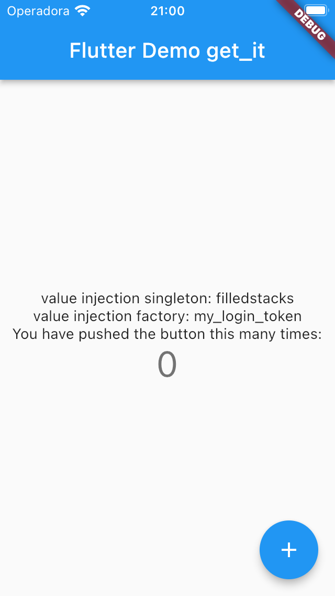

# get_it_example
 # Exemplo app usando `get_it` (Localizable).
 
  ### Projeto desenvolvido ultilizando:
  - [x] Flutter
  - [x] MVC
  - [x] get_it: ^7.2.0
  
 ## Print Screen :foggy:
 
||
|:---:|
| iOS |

